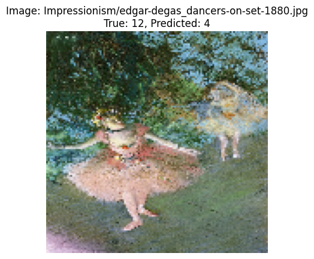
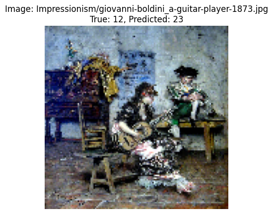
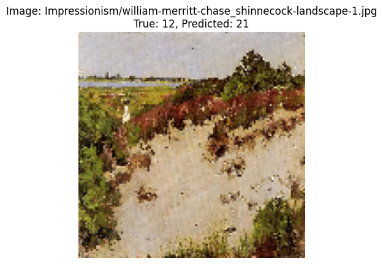
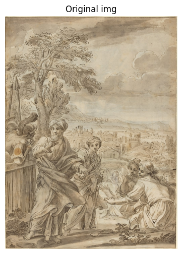
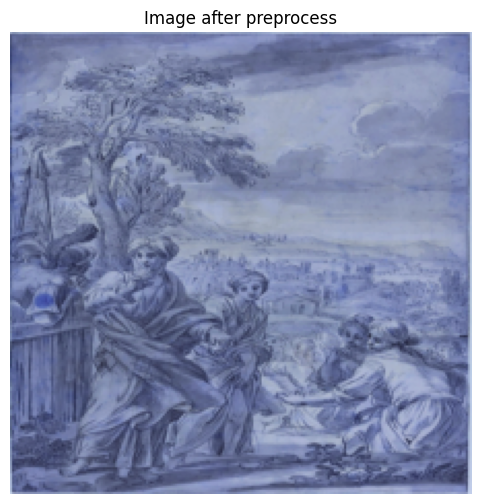
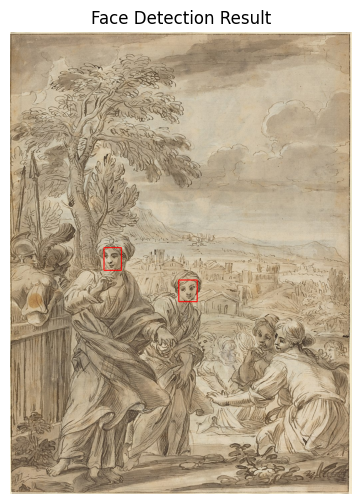
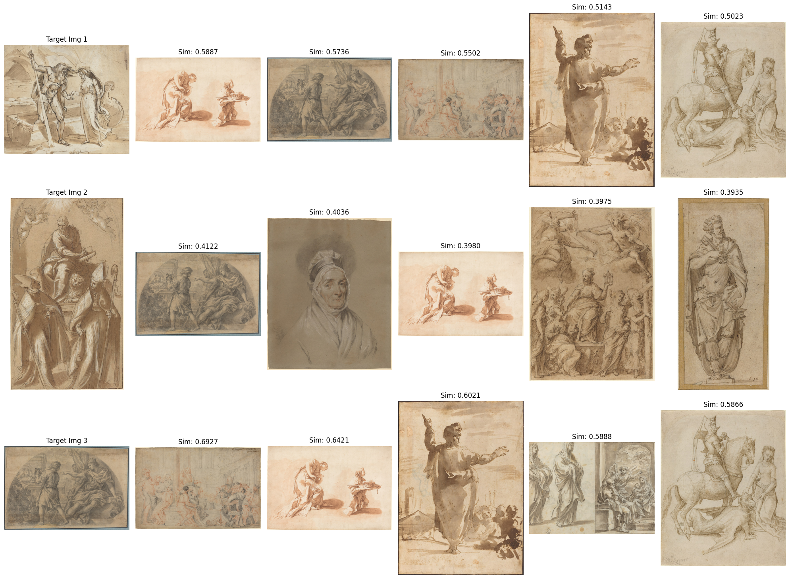

# **Image Classification & Artwork Similarity Detection**

This project is divided into two main tasks:

1. **Image Classification** – Using CNNs and LSTMs to classify artworks based on attributes like **style, artist, and genre**.
2. **Artwork Similarity Detection** – Using deep learning to find **visually similar paintings** based on extracted features.

## **Task 1: Image Classification with Convolutional-Recurrent Networks**

### **Overview**

The goal of this task is to classify images from the [ArtGAN dataset](https://github.com/cs-chan/ArtGAN/blob/master/WikiArt%20Dataset/README.md) based on **style, artist, and genre**. To achieve this, used a combination of **Convolutional Neural Networks (CNNs)** for feature extraction and **LSTM (Long Short-Term Memory) layers** to handle sequential patterns.

🔹 **Model Architecture:** CNN + LSTM  
🔹 **Dataset:** ArtGAN WikiArt dataset (25.4GB)  
🔹 **Example Task:** Style Classification

**📺 Explanation Video:**  
[](https://youtu.be/V0PKSvwiHs4)

---

### **📂 Dataset**

The full dataset is **too large** for this repository, but here provides sample data to work with. The original dataset includes paintings labeled by **style, artist, and genre**.

- **Style_train.csv** – Training data with image paths & style labels
- **Style_val.csv** – Validation data with image paths & labels

Each CSV file contains:

- **image_path** – Path to the image
- **class_index** – Numerical label for the style

---

### **⚙️ Installation**

Before running the code, install the required dependencies:

```bash
pip install tensorflow numpy pandas opencv-python scikit-learn matplotlib
```

📦 **Key Libraries:**  
✅ **TensorFlow/Keras** – Model training  
✅ **NumPy/Pandas** – Data handling  
✅ **OpenCV** – Image processing  
✅ **Matplotlib** – Visualization  
✅ **Scikit-learn** – Data preprocessing

---

### **🚀 How the Model Works**

1️⃣ **Load & Preprocess Data** – Images are resized and normalized.  
2️⃣ **Build the Model** – CNNs extract features; LSTMs process sequential patterns.  
3️⃣ **Data Generator** – A custom **ImageLabelGenerator** handles large datasets efficiently.  
4️⃣ **Train the Model** – Uses **fit()** with training data, batch size, and epochs.  
5️⃣ **Extract Features** – Intermediate features (e.g., `conv2d_3`) can be used for further analysis.  
6️⃣ **Make Predictions** – The trained model predicts artwork styles.  
7️⃣ **Evaluate Performance** – Metrics like **accuracy, loss, and confusion matrices** are used.

| Misclassification 1       | Misclassification 2   | Misclassification 3   |
| ------------------------- | --------------------- | --------------------- |
|  |  |  |

---

## **Task 2: Artwork Similarity Detection**

### **Overview**

This task focuses on finding **similar paintings** using deep learning-based **feature extraction** and similarity metrics.

🎨 **Image Preprocess**  
| Target Image | Preprocess |
|-------------|-------|
| | |

😊 **Face Features** (FaceNet + MTCNN)  
| Target Image | Face Detection |
|-------------|-------|
| | |

🎨 **Image Features** (ResNet)  
[]()

🕺 **Pose Features** (MediaPipe Pose)

🔹 **Similarity Metrics:**

- **Cosine Similarity** (for image & face features)
- **Euclidean Distance** (for pose features)
- **Weighted Similarity Score**

🔹 **Goal:** Given a painting, find **top-K similar artworks**

---

### **📂 Dataset**

Paintings from the **[National Gallery of Art open dataset](https://github.com/NationalGalleryOfArt/opendata)**. Images are downloaded from **[wikimedia](<https://commons.wikimedia.org/wiki/Category:Drawings_in_the_National_Gallery_of_Art_(Washington,_D.C.)>)** resized to **224×224** for deep learning models.

---

### **⚙️ Installation & Setup**

```bash
pip install torch torchvision facenet-pytorch mediapipe opencv-python numpy matplotlib scipy
```

---

### **📊 Evaluation Metrics**

Face detection shall be evaluated using **Precision, Recall, and F1-score**. However, as no ground truth data provided, the model does not do this comparing.

```python
precision = precision_score(y_true, y_pred)
recall = recall_score(y_true, y_pred)
f1 = f1_score(y_true, y_pred)
```

---

## **📸 Example Results**

Here’s an example of finding **the top 5 most similar paintings** to a given artwork:



---

## **📢 References**

```
[National Gallery of Art open dataset](https://github.com/NationalGalleryOfArt/opendata)
```

```
@article{artgan2018,
  title={Improved ArtGAN for Conditional Synthesis of Natural Image and Artwork},
  author={Tan, Wei Ren and Chan, Chee Seng and Aguirre, Hernan and Tanaka, Kiyoshi},
  journal={IEEE Transactions on Image Processing},
  volume    = {28},
  number    = {1},
  pages     = {394--409},
  year      = {2019},
  url       = {https://doi.org/10.1109/TIP.2018.2866698},
  doi       = {10.1109/TIP.2018.2866698}
}
```
