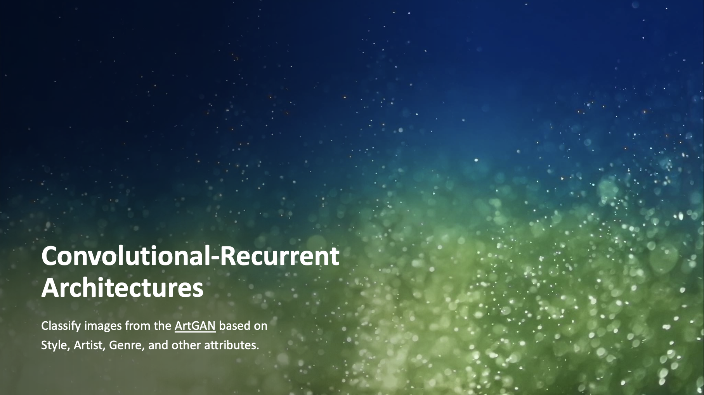

# Image Classification Project

## Task 1: Convolutional-Recurrent Architectures

### Overview

- Task 1 aims to classify images from the [ArtGAN](https://github.com/cs-chan/ArtGAN/blob/master/WikiArt%20Dataset/README.md) based on Style, Artist, Genre, and other attributes.

- The designed model used deep learning techniques, specifically Convolutional Neural Networks (CNNs) and LSTM (Long Short-Term Memory) layers.
- Explanation video as below:

  [](https://youtu.be/V0PKSvwiHs4)

### Data Source

- Given the whole [ArtGAN](https://github.com/cs-chan/ArtGAN/blob/master/WikiArt%20Dataset/README.md) with size of 25.4Gb. This repository contains only sample data. However, the model is run in local environment with full dataset.

- Use Style classification group as an example

  --> **Style_train.csv**: Contains paths to training images and their corresponding style labels.

  --> **Style_val.csv**: Contains paths to validation images and their corresponding labels.

- Each CSV file has two columns:
  --> **image_path**: The location of the image file.
  --> **class_index**: The numerical label for the style of the image.

### Installation

Before running the code, you'll need to install the necessary Python libraries.

```bash
pip install tensorflow numpy pandas opencv-python scikit-learn matplotlib
```

The main libraries used are:

- **TensorFlow** (for building and training the model)
- **Keras** (for high-level neural network tasks)
- **Numpy** (for numerical operations)
- **Pandas** (for handling and processing data)
- **OpenCV** (for image processing)
- **Matplotlib** (for visualizations)
- **Scikit-learn** (for data preprocessing and utilities)

### How task 1 is performed

1. **Load and Prepare the Data**: Load the CSV files that contain the image paths and labels. Preprocess the images, resizing them to the desired shape and normalizing the pixel values to a range between 0 and 1.

2. **Build the Model**: Use a combination of **CNNs** for extracting features from the images and **LSTM layers** for processing the sequential information in the data.

3. **Data Generator**: Since the task is working with large datasets, a custom **ImageLabelGenerator** is created.

4. **Extract Features**: After training the model, extract features from intermediate layers (such as `conv2d_3`) to analyze how the model is learning or to use these features in other tasks (like clustering or further analysis).

5. **Train the Model**: Train the model using the **fit** method, providing the training data generator and setting parameters like batch size and number of epochs.

6. **Make Predictions**: Once the model is trained, used it to make predictions on new images or evaluate its performance on the validation set.

7. **Evaluating the Model**: To assess the performance of the model, used metrics like **accuracy** and **loss**, **confusion matrices**.

## Task 2: Similarity

### Overview

Task 2 aims to classify images from the [National Gallery Of Art open data set](https://github.com/NationalGalleryOfArt/opendata) based on similarity.

## Reference:

```
@article{artgan2018,
  title={Improved ArtGAN for Conditional Synthesis of Natural Image and Artwork},
  author={Tan, Wei Ren and Chan, Chee Seng and Aguirre, Hernan and Tanaka, Kiyoshi},
  journal={IEEE Transactions on Image Processing},
  volume    = {28},
  number    = {1},
  pages     = {394--409},
  year      = {2019},
  url       = {https://doi.org/10.1109/TIP.2018.2866698},
  doi       = {10.1109/TIP.2018.2866698}
}
```
